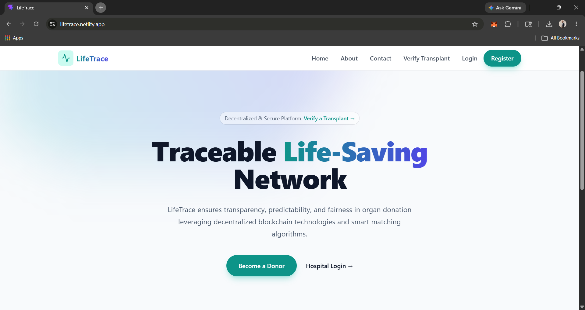
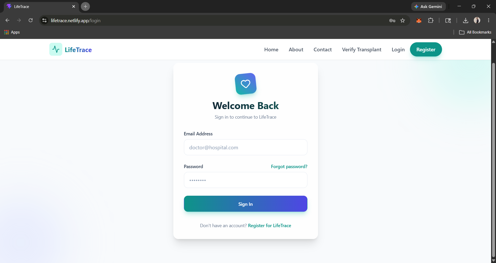
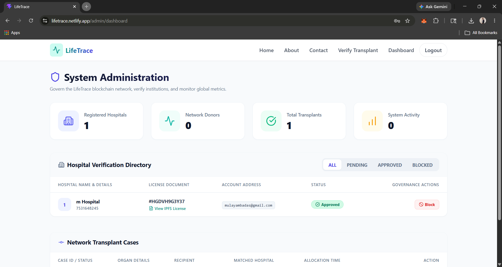
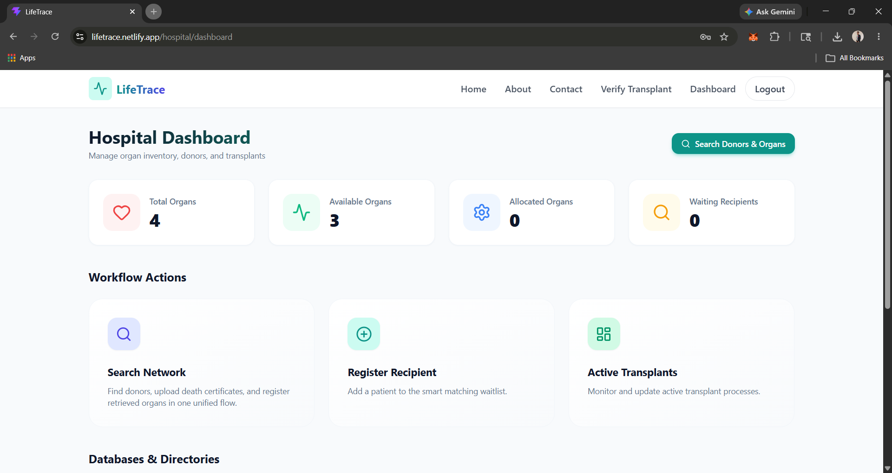
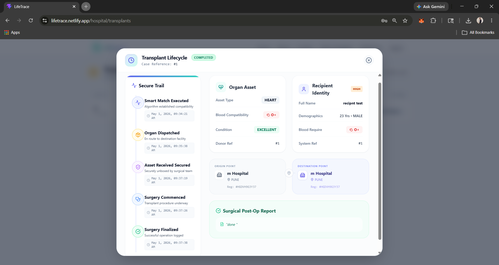
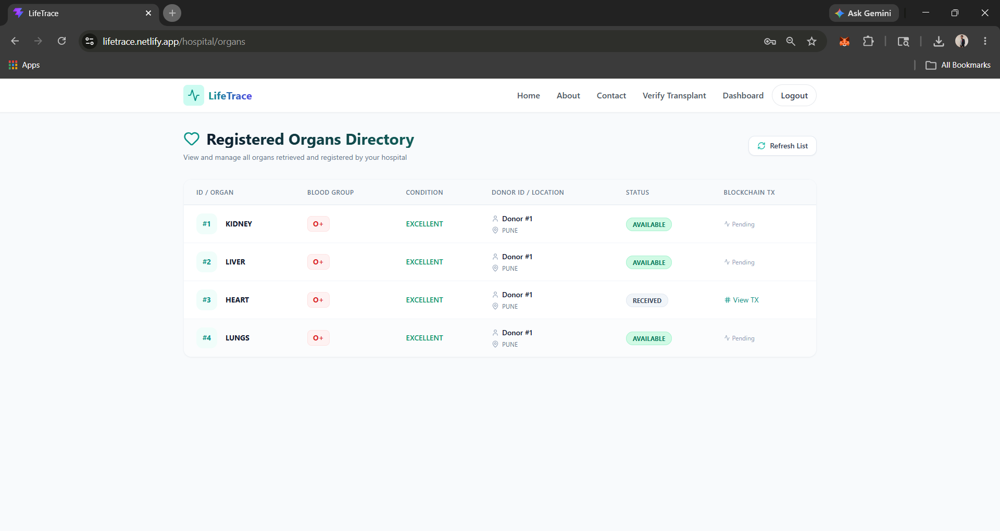
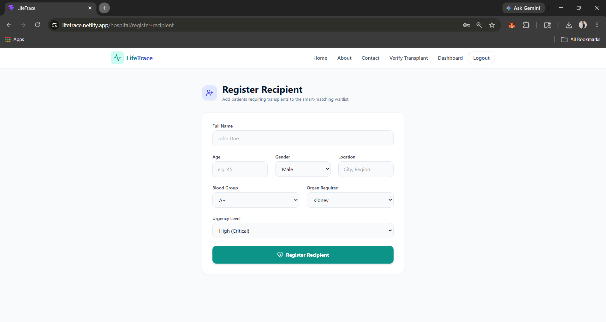

<div align="center">


# 🫀 LifeTrace
### Blockchain-Based Organ Donor Registry & Matching System

> *Saving lives through transparency, trust, and technology.*

 ---
### 🚀 Live Demo

https://lifetrace.netlify.app


</div>

---

## 🌟 About

**LifeTrace** is a full-stack decentralized organ donation platform connecting donors, recipients, and hospitals — powered by **Polygon Blockchain** and **IPFS**. Every consent, organ registration, and transplant event is cryptographically recorded for full transparency and tamper-proof auditability.

---

## ✨ Features

- 🔐 **JWT Auth** with role-based access (Admin / Hospital / Donor / Recipient) and OTP email verification
- 👤 **Donor Management** — self-registration, per-organ consent selection, digital consent form upload
- 🏥 **Hospital Management** — admin approval workflow, organ allocation, transplant monitoring dashboard
- 🫀 **Organ Matching** — ABO blood group compatibility, recipient prioritization scoring, smart allocation engine
- ⛓️ **Blockchain** — Polygon Amoy Testnet, Solidity smart contracts, every action generates an on-chain transaction with a verifiable hash
- 📦 **IPFS via Pinata** — decentralized consent storage, tamper-proof CID stored in both DB and blockchain
- 🔲 **QR Code Verification** — scan to instantly verify status on-chain
- 📧 **Automated Emails** — OTP, login alerts, hospital approvals, organ allocation & surgery result notifications via Brevo

---

## 🛠️ Tech Stack

| Layer | Technology |
|-------|------------|
| Frontend | React + Vite |
| Backend | Spring Boot + Spring Security |
| Database | MySQL |
| Auth | JWT |
| Blockchain | Polygon Amoy + Solidity + Web3j |
| Storage | IPFS + Pinata |
| Email | Brevo |
| Deploy | Netlify + Render |

---

## ⚙️ Installation

### Prerequisites
Java 17+, Maven 3.8+, Node.js 18+, MySQL 8+, Git

### 1️⃣ Clone
```bash
git clone https://github.com/mulayharshal/LifeTrace-Blockchain-Based-Organ-Donor-Registry-and-Matching-System.git
cd LifeTrace-Blockchain-Based-Organ-Donor-Registry-and-Matching-System
```

### 2️⃣ Database
```sql
CREATE DATABASE lifetrace_db;
```

### 3️⃣ Backend — configure `application.properties`
```properties
DB_URL=jdbc:mysql://localhost:3306/lifetrace_db
DB_USERNAME=your_username
DB_PASSWORD=your_password
JWT_SECRET=your_jwt_secret_min_32_chars
BREVO_API_KEY=your_brevo_key
BLOCKCHAIN_RPC_URL=https://rpc-amoy.polygon.technology/
BLOCKCHAIN_PRIVATE_KEY=your_wallet_private_key
BLOCKCHAIN_CONTRACT_ADDRESS=your_contract_address
CHAIN_ID=80002
PINATA_API_KEY=your_pinata_key
PINATA_SECRET_KEY=your_pinata_secret
```
> ⚠️ Never commit real credentials to version control.

```bash
cd backend
mvn spring-boot:run
# Runs at http://localhost:8080
```

### 4️⃣ Frontend
```bash
cd frontend
npm install
npm run dev
# Runs at http://localhost:5173
```

Add `.env` in `frontend/`:
```env
VITE_API_BASE_URL=http://localhost:8080
```

### 5️⃣ Smart Contract (Optional)
Deploy `LifeTrace.sol` via **Remix IDE** on Polygon Amoy, then paste the contract address into `BLOCKCHAIN_CONTRACT_ADDRESS`.

---

## ⛓️ Blockchain Setup

| Parameter | Value |
|-----------|-------|
| Network | Polygon Amoy Testnet |
| Chain ID | `80002` |
| RPC URL | `https://rpc-amoy.polygon.technology/` |
| Explorer | [amoy.polygonscan.com](https://amoy.polygonscan.com) |

🔗 Get free test tokens: [faucet.polygon.technology](https://faucet.polygon.technology/)

---

## 📸 Screenshots

 🏠 Home  
 🔐 Login   
 📊 Admin Dashboard   
 🏥 Hospital Dashboard   
 🛻 Transplant Case Tracking   
  🫀 Organs List   
🛌 Register Recipient   


---

## 👨‍💻 Author

<div align="center">

### Mulay Harshal Ambadas
**Java Full Stack Developer | IT Engineering Student**

[](https://github.com/mulayharshal)

</div>

---

## 📜 License

Developed for **educational and research purposes**. All blockchain interactions use Polygon Amoy **Testnet** — no real funds involved.

---

<div align="center">

**Built with ❤️ to save lives through technology**

*LifeTrace — Transparent. Trusted. Traceable.*

</div>
